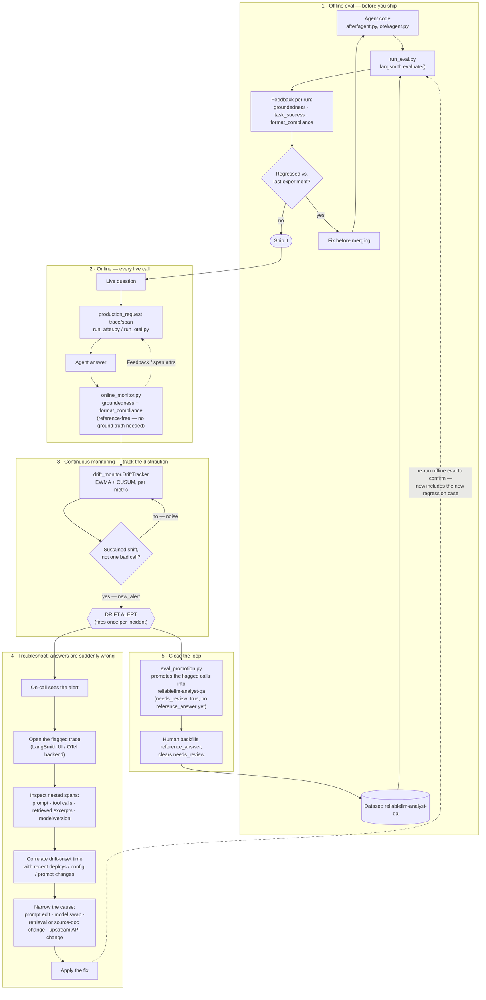
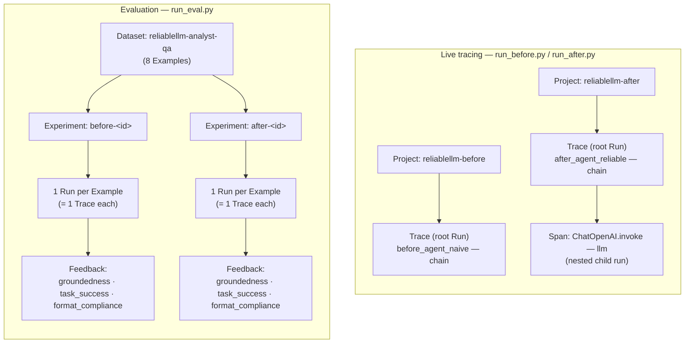

# ReliableLLM

This is a repo for DataCon — a runnable before/after demo of LLM observability
and evaluation, built to accompany the talk *"From Hype to Reliability:
Building LLM Evaluation & Observability Systems in Production."*

It implements the same task — grounded Q&A over a fictional earnings
document — twice:

- **`before`** — a naive integration: a raw OpenAI call, unstructured text
  output, no tracing, no instruction to abstain when the document doesn't
  have the answer.
- **`after`** — a reliable integration: LangChain + LangSmith tracing on
  every call, a Pydantic-enforced output schema (`answerable`, `answer`,
  `supporting_quote`), and a prompt that requires citing the document or
  explicitly saying the answer isn't there.
- **`otel`** — the same reliable agent as `after`, but with *no tracing code
  at all*. Observability comes from OpenTelemetry [zero-code
  auto-instrumentation](https://opentelemetry.io/docs/zero-code/python/)
  instead of a vendor SDK, so the trace destination is an env var, not a
  code change — LangSmith, Langfuse, Jaeger, Honeycomb, or any other
  OTLP-compatible backend all work unmodified.

`before` and `after` are run through the same LangSmith `evaluate()` dataset
and scored with the same evaluators, so the difference shows up as numbers,
not just prose. `otel` demonstrates the platform-agnostic alternative to
`after`'s tracing approach specifically — see [Vendor-neutral tracing with
OpenTelemetry](#vendor-neutral-tracing-with-opentelemetry) below.

## The observability & eval lifecycle, end to end

Every piece in this repo is one stage of the same loop: evaluate offline
before you ship, watch online after you ship, detect drift instead of
single bad calls, and feed what production teaches you back into the
offline eval so the benchmark never goes stale. The bottom half is also the
answer to "the agent suddenly starts giving wrong answers — how do you find
out why": the alert is what tells you, and the flagged trace is where you
start looking.



Two details worth calling out:

- **Why online eval can't just reuse the offline evaluators.** `task_success`
  needs a `reference_answer` a human wrote in advance — production traffic
  doesn't have one. Only `groundedness` and `format_compliance` are
  reference-free, so those are the two that run online; see [Online
  monitoring](#online-monitoring-catching-drift-as-it-happens) below.
- **Why the loop detects a *shift*, not a *sample*.** A single bad
  `groundedness=False` is usually just a hard question. What actually says
  "the agent regressed" is the rolling distribution moving — which is what
  turns a noisy per-call signal into a single, trustworthy alert instead of
  paging on every hard question. See
  [drift_monitor.py](#tracking-the-distribution-not-the-sample--drift_monitorpy).

`run_drift_demo.py` runs this exact loop end to end against a simulated
regression — see [Seeing it happen](#seeing-it-happen--run_drift_demopy)
below.

## Setup

Requires [uv](https://docs.astral.sh/uv/) and Python 3.13+.

```bash
uv sync
```

Copy your keys into `.env` (already gitignored):

```
OPENAI_API_KEY=...
LANGSMITH_TRACING=true
LANGSMITH_ENDPOINT=https://api.smith.langchain.com
LANGSMITH_API_KEY=...
LANGSMITH_PROJECT=reliablellm

# Optional: only needed if you want `otel`'s traces to land somewhere other
# than stdout. See "Vendor-neutral tracing with OpenTelemetry" below. This
# example points at LangSmith's own OTLP ingestion endpoint — a plain OTLP
# HTTP path, separate from the LangSmith SDK/@traceable used by after/.
OTEL_EXPORTER_OTLP_ENDPOINT=https://api.smith.langchain.com/otel
OTEL_EXPORTER_OTLP_HEADERS=x-api-key=<LANGSMITH_API_KEY>,Langsmith-Project=reliablellm-otel
```

`opentelemetry-instrument` reads `OTEL_EXPORTER_OTLP_*` from the shell
environment, not from `.env` directly (nothing in this repo calls
`load_dotenv()` before it starts) — so before any `otel` run, load `.env`
into the shell first:

```bash
set -a && source .env && set +a
```

## Running it

```bash
# Naive baseline — prints raw answers to stdout, no eval, no schema.
uv run python -m reliablellm.run_before

# Reliable version — prints structured, grounded answers.
# Traces to the "reliablellm-after" LangSmith project.
uv run python -m reliablellm.run_after

# Before vs after comparison: creates the "reliablellm-analyst-qa" dataset
# (once), runs both agents through langsmith.evaluate(), and prints a
# scored comparison table.
uv run python -m reliablellm.run_eval

# Vendor-neutral version of run_after — same agent, but traced via OpenTelemetry
# zero-code auto-instrumentation instead of LangSmith. Must be launched through
# opentelemetry-instrument, not plain `python`, for spans to be captured.
# --traces_exporter console just prints spans to stdout, no backend required.
uv run opentelemetry-instrument \
    --service_name reliablellm-otel \
    --traces_exporter console \
    python -m reliablellm.run_otel

# Same thing, shipped via OTLP instead of stdout (LangSmith's OTLP endpoint
# by default — see Setup above) — requires the OTEL_EXPORTER_OTLP_* vars from
# .env to be loaded into the shell first and --traces_exporter switched to
# otlp_proto_http.
set -a && source .env && set +a
uv run opentelemetry-instrument \
    --service_name reliablellm-otel \
    --traces_exporter otlp_proto_http \
    --metrics_exporter none \
    --logs_exporter none \
    python -m reliablellm.run_otel
```

## Tracing concepts

LangSmith's vocabulary shows up directly in this code (`@traceable`, `tracing_context`,
`project_name`, `experiment_prefix`), so here's what each term means and where it comes
from in the repo:

| Term | What it is | Where it comes from here |
|---|---|---|
| **Run** (aka **span**) | The atomic unit LangSmith records: one function/model/tool call, with inputs, outputs, timing, and a `run_type` (`chain`, `llm`, `tool`, ...). "Span" is the general observability term (OpenTelemetry lineage); "run" is LangSmith's name for the same thing. | Every `@traceable`-wrapped call — e.g. `answer_question` in `after/agent.py` — creates one run. |
| **Trace** | The full tree of runs produced by one top-level call, identified by its root run's id. A trace can be a single flat run, or a run with nested child runs. | One call to `answer_question()` = one trace. `before`'s trace is flat (the raw `openai` client call isn't instrumented, so there's no child span). `after`'s trace has a nested `ChatOpenAI` LLM span under the chain run, because LangChain auto-instruments its own model calls. |
| **Project** (LangSmith's REST API still calls it a **session**, `/sessions`) | A named bucket that traces get written into — like a folder for live/online traces. | `LANGSMITH_PROJECT` in `.env` sets the default; `run_before.py` and `run_after.py` override it per-script (`reliablellm-before` / `reliablellm-after`) via `@traceable(project_name=...)` and `tracing_context(project_name=...)` so the two are visually separated in the UI. It is like back and forth of the conversation or state between runs. |
| **Dataset** / **Example** | A stored, reusable set of test inputs + reference outputs. | `reliablellm-analyst-qa`, created once in `run_eval.py::ensure_dataset`. Each entry in `document.py::EVAL_CASES` becomes one Example. |
| **Experiment** | A named batch run over a dataset, produced by `evaluate()`. Every example in the dataset generates its own trace, and each trace gets scored by the evaluators. | `before-<id>` and `after-<id>`, one per `evaluate()` call in `run_eval.py`. This is what the printed comparison table and LangSmith URLs point to. |
| **Feedback** | A score or label attached to a specific run. | Each evaluator in `after/evaluators.py` returns `{"key": ..., "score": ...}`; `evaluate()` uploads that as feedback on the run it scored — that's what fills in `groundedness` / `task_success` / `format_compliance` in the UI and in `mean_scores()`. |



The two flows share the same underlying pieces (a trace is always a tree of runs, a project
is always where live traces land, an experiment is always a dataset run scored with
feedback) — `run_before`/`run_after` show you one trace at a time as you'd see it live,
while `run_eval` runs the whole dataset through `evaluate()` and rolls the feedback up into
the before-vs-after table.

## Vendor-neutral tracing with OpenTelemetry

`after/agent.py` gets its tracing by importing the LangSmith SDK and wrapping
the function in `@traceable` — the tracing choice is baked into the code.
`otel/agent.py` is the same agent (same schema, same prompt, same
`ChatOpenAI` call) with that import and decorator deleted entirely. It has no
knowledge that it's being traced at all.

That's the point of OpenTelemetry's [zero-code
instrumentation](https://opentelemetry.io/docs/zero-code/python/): instead of
an SDK call inside your code, a launcher process (`opentelemetry-instrument`)
patches known libraries — here, the `openai` client, via
`opentelemetry-instrumentation-openai-v2` — before your application ever
imports them. Every `openai` call anywhere in the process becomes a span,
including the ones LangChain makes on your behalf, without `otel/agent.py`
importing an observability package or knowing which backend it's talking to.

**One footnote worth knowing about:** `otel/agent.py` calls
`with_structured_output(AnalystAnswer, method="function_calling")` instead of
the library default. The default method routes through the openai SDK's
`.chat.completions.with_raw_response.parse()`, which the current
`opentelemetry-instrumentation-openai-v2` release doesn't patch (it only
wraps `Completions.create` / `AsyncCompletions.create`) — so those calls
would silently produce zero spans. `function_calling` uses `.create()` with a
tool call instead, which *is* instrumented. It's a real example of the tradeoff
zero-code instrumentation makes: no code changes for tracing, but coverage
depends on which internal method the library happens to call.

### Pointing it at a different backend

Nothing in the code names a destination — it's entirely env vars /
`opentelemetry-instrument` flags. `OTEL_EXPORTER_OTLP_ENDPOINT` and
`OTEL_EXPORTER_OTLP_HEADERS` in `.env` are already set to **LangSmith's own
OTLP ingestion endpoint** — a plain OTLP HTTP path (`x-api-key` +
`Langsmith-Project` headers), completely separate from the LangSmith
SDK/`@traceable` machinery `after/` uses. So once you've loaded `.env` into
the shell (`set -a && source .env && set +a`), switching between stdout and
LangSmith is just the one flag:

```bash
# Print spans to stdout, no backend required:
uv run opentelemetry-instrument --service_name reliablellm-otel \
    --traces_exporter console python -m reliablellm.run_otel

# Ship to LangSmith via OTLP instead:
set -a && source .env && set +a
uv run opentelemetry-instrument --service_name reliablellm-otel \
    --traces_exporter otlp_proto_http \
    --metrics_exporter none --logs_exporter none \
    python -m reliablellm.run_otel
```

`Langsmith-Project=reliablellm-otel` routes these into their own project, so
they don't land in whatever `LANGSMITH_PROJECT` (`datacon` by default) the
SDK-based `after/` module uses — and since `run_otel.py` explicitly disables
`LANGSMITH_TRACING`/`LANGCHAIN_TRACING_V2` before calling the agent (see
below), this OTLP path is the *only* way `otel` traces reach LangSmith; there's
no double-reporting through the SDK.

**Important:** those two vars have to be in the *shell* environment before
`opentelemetry-instrument` starts — it configures the exporter at process
bootstrap, before `run_otel.py`'s own `load_dotenv()` call ever runs, so
having them only in `.env` without `source`-ing it first silently falls back
to the default exporter target.

**Also important:** use `--traces_exporter otlp_proto_http`, not the bare
`otlp`. `otlp` resolves to the **gRPC** OTLP exporter, which talks to
`host:port` and ignores URL paths — pointed at a path-based endpoint like
`/otel` it doesn't fail cleanly, it dies mid-run with a grpc
`_InactiveRpcError` ("Received http2 header with status: 464") the first
time it tries to flush a batch. `otlp_proto_http` speaks plain OTLP over
HTTPS to the exact URL in `OTEL_EXPORTER_OTLP_ENDPOINT`, which is what
LangSmith's (and most SaaS OTLP) endpoints actually expect.

`opentelemetry-instrument` also auto-exports **metrics**, not just traces —
`opentelemetry-instrumentation-openai-v2` records token-usage metrics
alongside spans, and `--metrics_exporter` defaults to `otlp` (the same gRPC
exporter, same failure mode) independently of whatever you passed
`--traces_exporter`. LangSmith's OTLP endpoint only implements traces
ingestion, so rather than fighting metrics onto HTTP too, `--metrics_exporter
none --logs_exporter none` just turns those pipelines off.

Swap `OTEL_EXPORTER_OTLP_ENDPOINT`/`OTEL_EXPORTER_OTLP_HEADERS` for Langfuse,
Jaeger, Honeycomb, Grafana Tempo, or any other OTLP collector and the same
command works — `otel/agent.py` never changes.

**Limitation:** this only replaces `after`'s *tracing* mechanism. `run_eval.py`'s
dataset, `evaluate()`, experiments, and batch feedback scores are LangSmith
platform features with no OpenTelemetry equivalent, so there's no
`run_otel`-based version of that comparison — `otel` mirrors `after/agent.py`
and `run_after.py` only. Per-call online scoring (below) is the one piece
that *does* have an OTel-native equivalent, since it doesn't depend on a
LangSmith dataset or experiment.

## Online monitoring: catching drift as it happens

`run_eval.py` only scores answers when you remember to run it — against a
fixed dataset, on your schedule. `online_monitor.py` scores every call
`run_after.py` and `run_otel.py` make, the moment each one finishes, using
the same evaluator functions from `after/evaluators.py`:

- **`groundedness`** and **`format_compliance`** run online. Both judge the
  answer against the source document and its own shape — nothing that
  requires a pre-written reference answer, which is exactly what's available
  for a real production call.
- **`task_success`** stays offline-only, in `run_eval.py`. It compares the
  answer to a curated `reference_answer`, which production traffic doesn't
  have.

Both runners wrap each question in its own `production_request` trace/span
before calling the agent, so there's something for the online monitor to
attach the score to once the answer comes back:

- `run_after.py` opens a LangSmith `trace()` per question and passes its
  `run.id` (and the resolved `session_id`, to keep `create_feedback` off the
  deprecated no-session path) down the chain, which eventually posts each
  evaluator's result as Feedback on that run — visible in the LangSmith UI
  immediately, not after the next `run_eval.py` pass.
- `run_otel.py` opens an OTel span per question with
  `tracer.start_as_current_span()`; the score gets written as
  `online_monitor.<key>.score` (and `.comment`) attributes on that span
  while it's still current. This lives in the runner, not in
  `otel/agent.py` — the agent itself stays exactly as "zero tracing code"
  as advertised above; the monitor is observability infrastructure, not the
  thing being observed.

Either path prints `[online-monitor] <key>=<score>` to stdout as it happens,
with a `<-- FLAGGED` marker on any `False`, so a single bad score is visible
in the terminal without opening a dashboard. But a single bad score, on its
own, is *not* drift — that's what the next two pieces are for.

### Tracking the distribution, not the sample — `drift_monitor.py`

A lone `groundedness=False` is usually just a hard question, not a
regression. `drift_monitor.DriftTracker` runs two textbook
statistical-process-control detectors over each metric's score stream and
only calls it drift when one of them trips:

- **EWMA** (exponentially weighted moving average) — smooths the noisy 0/1
  stream and alerts once the smoothed value falls a fixed margin below the
  healthy baseline. Catches a gradual decline.
- **CUSUM** (cumulative sum) — accumulates each sample's deviation below
  baseline, net of a small allowed slack, and alerts once the running total
  passes a threshold. A single bad sample gets mostly absorbed by the slack;
  a *sustained* run of them doesn't, because a passing sample only pulls the
  sum back toward zero by the slack amount, not all the way.

The first `BURN_IN` samples just establish the baseline mean (no alerting
yet); after that, both detectors are unnormalized — measured directly in
probability space rather than divided by an estimated variance — because a
real "healthy" groundedness rate is often a literal 1.0 during burn-in,
which would collapse a variance-normalized control band to zero width and
alert on the very next blip. Once alerted, `new_alert` debounces further
reporting: `alert` stays `True` for as long as the shift persists (used to
keep promoting evidence, see below), but the loud "drift detected" signal
only fires once, on the healthy→drifted transition — not once per call for
the whole length of an incident.

### Closing the loop — `eval_promotion.py`

When a metric drifts, `continuous_feedback.py` (the module that wires
`online_monitor` → `drift_monitor` → `eval_promotion` together, and the one
`run_after.py`/`run_otel.py` actually call — `observe_live_call()`, in
place of calling `online_monitor.score_live_call()` directly) pulls the
recent calls in its rolling window that scored `False` on the drifting
metric and hasn't already been promoted, and hands them to
`eval_promotion.promote_flagged_calls()`. That writes each one into
`reliablellm-analyst-qa` — the same dataset `run_eval.py` scores against —
as a new Example, tagged in `metadata` with `source: production-drift`,
`flagged_metric`, the original run id, and `needs_review: true`.

They come in with `reference_answer: null` on purpose: production has no
ground truth, and `task_success` (the only evaluator that needs one) would
just be scoring against a fabricated target. Landing with no reference
still makes them immediately useful for `groundedness`/`format_compliance`
in the next `run_eval.py` pass, and ready for a human to backfill a real
reference answer and clear the flag whenever someone gets to it. This is
the mechanism that keeps the benchmark growing from what production is
actually seeing, instead of staying frozen at whatever `EVAL_CASES` looked
like when someone last hand-wrote it.

### Seeing it happen — `run_drift_demo.py`

`run_after.py` and `run_otel.py` only run 8 questions — not enough history
to realistically trip a distribution check, and the real agent is accurate
enough that it shouldn't drift in a short demo anyway. `run_drift_demo.py`
simulates the failure instead of waiting for it:

```bash
uv run python -m reliablellm.run_drift_demo
```

It runs a **healthy** phase (the real questions through the real
`after/agent.py`, to establish the baseline) followed by a **drifted**
phase that skips the real agent and returns one fixed, fluent, entirely
fabricated `AnalystAnswer` for every question — standing in for a real
failure mode (a bad deploy, a prompt regression, a swapped model that stops
actually reading the document) where the agent keeps answering confidently
and incorrectly instead of erroring out somewhere loud.
`online_monitor.py`'s judge still runs for real against these, so what
catches it is the actual EWMA/CUSUM math, not a canned result. Watch for
`ewma`/`cusum` sinking through the drifted phase, one `<-- DRIFT ALERT
(new)` line, then repeated `promoting N flagged call(s) ... into the eval
dataset` — while `format_compliance` stays perfectly healthy throughout,
since the fabricated answer is still a well-formed object. That split is
the point: each metric is tracked, and alerts, independently. Traces land
in the `reliablellm-drift-demo` LangSmith project, separate from
`reliablellm-after`, so a demo run never mixes into the real one.

**Heads up:** this script *will* write new Examples into
`reliablellm-analyst-qa` (the same dataset `run_eval.py` uses) — that's the
point, but it means re-running the demo repeatedly grows that dataset with
duplicate synthetic entries each time. Clean up afterward if you don't want
them there:

```python
from langsmith import Client
from reliablellm.run_eval import DATASET_NAME

client = Client()
dataset = client.read_dataset(dataset_name=DATASET_NAME)
for example in client.list_examples(dataset_id=dataset.id):
    if (example.metadata or {}).get("source") == "production-drift":
        client.delete_example(example.id)
```

## What to expect

**`run_before`** — a wall of plain text. Answers are usually plausible, but
there's no way to tell an answerable question from a hallucinated one
without reading every response by hand, and nothing is machine-parseable.

**`run_after`** — the same questions, but every answer comes back as a typed
object: an explicit `answerable` flag, an `answer`, and a `supporting_quote`
pulled directly from the source document. Out-of-scope questions come back
`answerable: False` instead of a guess. Every call is traced in LangSmith
under the `reliablellm-after` project, so you can open a run and see exactly
what the model saw and produced.

**`run_otel`** — identical structured output to `run_after`, but launched
through `opentelemetry-instrument`. With `--traces_exporter console` you'll
see a JSON span (`gen_ai.request.model`, `gen_ai.usage.input_tokens`, etc.)
printed after each answer instead of a LangSmith URL — same information,
different transport, zero tracing code in `otel/agent.py`.

**`run_eval`** — prints a table like this, comparing mean scores across the
shared dataset:

| metric | before | after |
|---|---|---|
| groundedness | judged per run | judged per run |
| task_success | judged per run | judged per run |
| format_compliance | **0.00** | **1.00** |

`format_compliance` is the deterministic signal: `before` never emits a
schema, so it always scores 0; `after` always does, so it always scores 1.
`groundedness` and `task_success` are LLM-judged against the source document
and reference answers, so they'll vary run to run — that's real evaluation,
not a fixed demo number. Both experiments print a LangSmith URL for the full
trace-level comparison.
