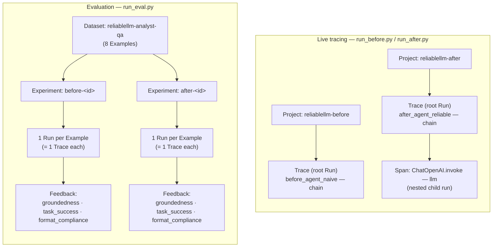

# ReliableLLM

This is a repo for DataCon — a runnable before/after demo of LLM observability
and evaluation, built to accompany the talk *"From Hype to Reliability:
Building LLM Evaluation & Observability Systems in Production."*

It implements the same task — grounded Q&A over a fictional earnings
document — twice:

- **`before`** — a naive integration: a raw OpenAI call, unstructured text
  output, no tracing, no instruction to abstain when the document doesn't
  have the answer.
- **`after`** — a reliable integration: LangChain + LangSmith tracing on
  every call, a Pydantic-enforced output schema (`answerable`, `answer`,
  `supporting_quote`), and a prompt that requires citing the document or
  explicitly saying the answer isn't there.

Both are run through the same LangSmith `evaluate()` dataset and scored with
the same evaluators, so the difference shows up as numbers, not just prose.

## Setup

Requires [uv](https://docs.astral.sh/uv/) and Python 3.13+.

```bash
uv sync
```

Copy your keys into `.env` (already gitignored):

```
OPENAI_API_KEY=...
LANGSMITH_TRACING=true
LANGSMITH_ENDPOINT=https://api.smith.langchain.com
LANGSMITH_API_KEY=...
LANGSMITH_PROJECT=reliablellm
```

## Running it

```bash
# Naive baseline — prints raw answers to stdout, no eval, no schema.
uv run python -m reliablellm.run_before

# Reliable version — prints structured, grounded answers.
# Traces to the "reliablellm-after" LangSmith project.
uv run python -m reliablellm.run_after

# Before vs after comparison: creates the "reliablellm-analyst-qa" dataset
# (once), runs both agents through langsmith.evaluate(), and prints a
# scored comparison table.
uv run python -m reliablellm.run_eval
```

## Tracing concepts

LangSmith's vocabulary shows up directly in this code (`@traceable`, `tracing_context`,
`project_name`, `experiment_prefix`), so here's what each term means and where it comes
from in the repo:

| Term | What it is | Where it comes from here |
|---|---|---|
| **Run** (aka **span**) | The atomic unit LangSmith records: one function/model/tool call, with inputs, outputs, timing, and a `run_type` (`chain`, `llm`, `tool`, ...). "Span" is the general observability term (OpenTelemetry lineage); "run" is LangSmith's name for the same thing. | Every `@traceable`-wrapped call — e.g. `answer_question` in `after/agent.py` — creates one run. |
| **Trace** | The full tree of runs produced by one top-level call, identified by its root run's id. A trace can be a single flat run, or a run with nested child runs. | One call to `answer_question()` = one trace. `before`'s trace is flat (the raw `openai` client call isn't instrumented, so there's no child span). `after`'s trace has a nested `ChatOpenAI` LLM span under the chain run, because LangChain auto-instruments its own model calls. |
| **Project** (LangSmith's REST API still calls it a **session**, `/sessions`) | A named bucket that traces get written into — like a folder for live/online traces. | `LANGSMITH_PROJECT` in `.env` sets the default; `run_before.py` and `run_after.py` override it per-script (`reliablellm-before` / `reliablellm-after`) via `@traceable(project_name=...)` and `tracing_context(project_name=...)` so the two are visually separated in the UI. |
| **Dataset** / **Example** | A stored, reusable set of test inputs + reference outputs. | `reliablellm-analyst-qa`, created once in `run_eval.py::ensure_dataset`. Each entry in `document.py::EVAL_CASES` becomes one Example. |
| **Experiment** | A named batch run over a dataset, produced by `evaluate()`. Every example in the dataset generates its own trace, and each trace gets scored by the evaluators. | `before-<id>` and `after-<id>`, one per `evaluate()` call in `run_eval.py`. This is what the printed comparison table and LangSmith URLs point to. |
| **Feedback** | A score or label attached to a specific run. | Each evaluator in `after/evaluators.py` returns `{"key": ..., "score": ...}`; `evaluate()` uploads that as feedback on the run it scored — that's what fills in `groundedness` / `task_success` / `format_compliance` in the UI and in `mean_scores()`. |



The two flows share the same underlying pieces (a trace is always a tree of runs, a project
is always where live traces land, an experiment is always a dataset run scored with
feedback) — `run_before`/`run_after` show you one trace at a time as you'd see it live,
while `run_eval` runs the whole dataset through `evaluate()` and rolls the feedback up into
the before-vs-after table.

## What to expect

**`run_before`** — a wall of plain text. Answers are usually plausible, but
there's no way to tell an answerable question from a hallucinated one
without reading every response by hand, and nothing is machine-parseable.

**`run_after`** — the same questions, but every answer comes back as a typed
object: an explicit `answerable` flag, an `answer`, and a `supporting_quote`
pulled directly from the source document. Out-of-scope questions come back
`answerable: False` instead of a guess. Every call is traced in LangSmith
under the `reliablellm-after` project, so you can open a run and see exactly
what the model saw and produced.

**`run_eval`** — prints a table like this, comparing mean scores across the
shared dataset:

| metric | before | after |
|---|---|---|
| groundedness | judged per run | judged per run |
| task_success | judged per run | judged per run |
| format_compliance | **0.00** | **1.00** |

`format_compliance` is the deterministic signal: `before` never emits a
schema, so it always scores 0; `after` always does, so it always scores 1.
`groundedness` and `task_success` are LLM-judged against the source document
and reference answers, so they'll vary run to run — that's real evaluation,
not a fixed demo number. Both experiments print a LangSmith URL for the full
trace-level comparison.
