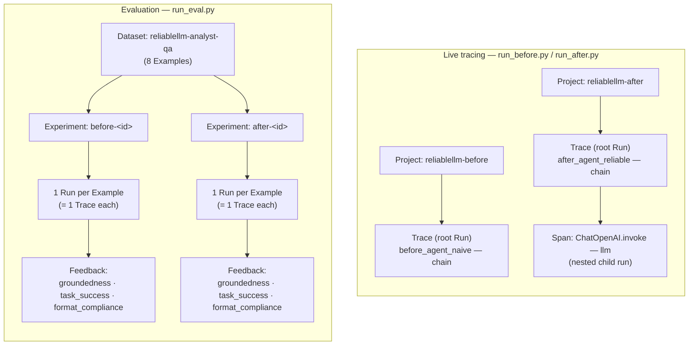

# ReliableLLM

This is a repo for DataCon — a runnable before/after demo of LLM observability
and evaluation, built to accompany the talk *"From Hype to Reliability:
Building LLM Evaluation & Observability Systems in Production."*

It implements the same task — grounded Q&A over a fictional earnings
document — twice:

- **`before`** — a naive integration: a raw OpenAI call, unstructured text
  output, no tracing, no instruction to abstain when the document doesn't
  have the answer.
- **`after`** — a reliable integration: LangChain + LangSmith tracing on
  every call, a Pydantic-enforced output schema (`answerable`, `answer`,
  `supporting_quote`), and a prompt that requires citing the document or
  explicitly saying the answer isn't there.
- **`otel`** — the same reliable agent as `after`, but with *no tracing code
  at all*. Observability comes from OpenTelemetry [zero-code
  auto-instrumentation](https://opentelemetry.io/docs/zero-code/python/)
  instead of a vendor SDK, so the trace destination is an env var, not a
  code change — LangSmith, Langfuse, Jaeger, Honeycomb, or any other
  OTLP-compatible backend all work unmodified.

`before` and `after` are run through the same LangSmith `evaluate()` dataset
and scored with the same evaluators, so the difference shows up as numbers,
not just prose. `otel` demonstrates the platform-agnostic alternative to
`after`'s tracing approach specifically — see [Vendor-neutral tracing with
OpenTelemetry](#vendor-neutral-tracing-with-opentelemetry) below.

## Setup

Requires [uv](https://docs.astral.sh/uv/) and Python 3.13+.

```bash
uv sync
```

Copy your keys into `.env` (already gitignored):

```
OPENAI_API_KEY=...
LANGSMITH_TRACING=true
LANGSMITH_ENDPOINT=https://api.smith.langchain.com
LANGSMITH_API_KEY=...
LANGSMITH_PROJECT=reliablellm

# Optional: only needed if you want `otel`'s traces to land somewhere other
# than stdout. See "Vendor-neutral tracing with OpenTelemetry" below. This
# example points at LangSmith's own OTLP ingestion endpoint — a plain OTLP
# HTTP path, separate from the LangSmith SDK/@traceable used by after/.
OTEL_EXPORTER_OTLP_ENDPOINT=https://api.smith.langchain.com/otel
OTEL_EXPORTER_OTLP_HEADERS=x-api-key=<LANGSMITH_API_KEY>,Langsmith-Project=reliablellm-otel
```

`opentelemetry-instrument` reads `OTEL_EXPORTER_OTLP_*` from the shell
environment, not from `.env` directly (nothing in this repo calls
`load_dotenv()` before it starts) — so before any `otel` run, load `.env`
into the shell first:

```bash
set -a && source .env && set +a
```

## Running it

```bash
# Naive baseline — prints raw answers to stdout, no eval, no schema.
uv run python -m reliablellm.run_before

# Reliable version — prints structured, grounded answers.
# Traces to the "reliablellm-after" LangSmith project.
uv run python -m reliablellm.run_after

# Before vs after comparison: creates the "reliablellm-analyst-qa" dataset
# (once), runs both agents through langsmith.evaluate(), and prints a
# scored comparison table.
uv run python -m reliablellm.run_eval

# Vendor-neutral version of run_after — same agent, but traced via OpenTelemetry
# zero-code auto-instrumentation instead of LangSmith. Must be launched through
# opentelemetry-instrument, not plain `python`, for spans to be captured.
# --traces_exporter console just prints spans to stdout, no backend required.
uv run opentelemetry-instrument \
    --service_name reliablellm-otel \
    --traces_exporter console \
    python -m reliablellm.run_otel

# Same thing, shipped via OTLP instead of stdout (LangSmith's OTLP endpoint
# by default — see Setup above) — requires the OTEL_EXPORTER_OTLP_* vars from
# .env to be loaded into the shell first and --traces_exporter switched to
# otlp_proto_http.
set -a && source .env && set +a
uv run opentelemetry-instrument \
    --service_name reliablellm-otel \
    --traces_exporter otlp_proto_http \
    --metrics_exporter none \
    --logs_exporter none \
    python -m reliablellm.run_otel
```

## Tracing concepts

LangSmith's vocabulary shows up directly in this code (`@traceable`, `tracing_context`,
`project_name`, `experiment_prefix`), so here's what each term means and where it comes
from in the repo:

| Term | What it is | Where it comes from here |
|---|---|---|
| **Run** (aka **span**) | The atomic unit LangSmith records: one function/model/tool call, with inputs, outputs, timing, and a `run_type` (`chain`, `llm`, `tool`, ...). "Span" is the general observability term (OpenTelemetry lineage); "run" is LangSmith's name for the same thing. | Every `@traceable`-wrapped call — e.g. `answer_question` in `after/agent.py` — creates one run. |
| **Trace** | The full tree of runs produced by one top-level call, identified by its root run's id. A trace can be a single flat run, or a run with nested child runs. | One call to `answer_question()` = one trace. `before`'s trace is flat (the raw `openai` client call isn't instrumented, so there's no child span). `after`'s trace has a nested `ChatOpenAI` LLM span under the chain run, because LangChain auto-instruments its own model calls. |
| **Project** (LangSmith's REST API still calls it a **session**, `/sessions`) | A named bucket that traces get written into — like a folder for live/online traces. | `LANGSMITH_PROJECT` in `.env` sets the default; `run_before.py` and `run_after.py` override it per-script (`reliablellm-before` / `reliablellm-after`) via `@traceable(project_name=...)` and `tracing_context(project_name=...)` so the two are visually separated in the UI. |
| **Dataset** / **Example** | A stored, reusable set of test inputs + reference outputs. | `reliablellm-analyst-qa`, created once in `run_eval.py::ensure_dataset`. Each entry in `document.py::EVAL_CASES` becomes one Example. |
| **Experiment** | A named batch run over a dataset, produced by `evaluate()`. Every example in the dataset generates its own trace, and each trace gets scored by the evaluators. | `before-<id>` and `after-<id>`, one per `evaluate()` call in `run_eval.py`. This is what the printed comparison table and LangSmith URLs point to. |
| **Feedback** | A score or label attached to a specific run. | Each evaluator in `after/evaluators.py` returns `{"key": ..., "score": ...}`; `evaluate()` uploads that as feedback on the run it scored — that's what fills in `groundedness` / `task_success` / `format_compliance` in the UI and in `mean_scores()`. |



The two flows share the same underlying pieces (a trace is always a tree of runs, a project
is always where live traces land, an experiment is always a dataset run scored with
feedback) — `run_before`/`run_after` show you one trace at a time as you'd see it live,
while `run_eval` runs the whole dataset through `evaluate()` and rolls the feedback up into
the before-vs-after table.

## Vendor-neutral tracing with OpenTelemetry

`after/agent.py` gets its tracing by importing the LangSmith SDK and wrapping
the function in `@traceable` — the tracing choice is baked into the code.
`otel/agent.py` is the same agent (same schema, same prompt, same
`ChatOpenAI` call) with that import and decorator deleted entirely. It has no
knowledge that it's being traced at all.

That's the point of OpenTelemetry's [zero-code
instrumentation](https://opentelemetry.io/docs/zero-code/python/): instead of
an SDK call inside your code, a launcher process (`opentelemetry-instrument`)
patches known libraries — here, the `openai` client, via
`opentelemetry-instrumentation-openai-v2` — before your application ever
imports them. Every `openai` call anywhere in the process becomes a span,
including the ones LangChain makes on your behalf, without `otel/agent.py`
importing an observability package or knowing which backend it's talking to.

**One footnote worth knowing about:** `otel/agent.py` calls
`with_structured_output(AnalystAnswer, method="function_calling")` instead of
the library default. The default method routes through the openai SDK's
`.chat.completions.with_raw_response.parse()`, which the current
`opentelemetry-instrumentation-openai-v2` release doesn't patch (it only
wraps `Completions.create` / `AsyncCompletions.create`) — so those calls
would silently produce zero spans. `function_calling` uses `.create()` with a
tool call instead, which *is* instrumented. It's a real example of the tradeoff
zero-code instrumentation makes: no code changes for tracing, but coverage
depends on which internal method the library happens to call.

### Pointing it at a different backend

Nothing in the code names a destination — it's entirely env vars /
`opentelemetry-instrument` flags. `OTEL_EXPORTER_OTLP_ENDPOINT` and
`OTEL_EXPORTER_OTLP_HEADERS` in `.env` are already set to **LangSmith's own
OTLP ingestion endpoint** — a plain OTLP HTTP path (`x-api-key` +
`Langsmith-Project` headers), completely separate from the LangSmith
SDK/`@traceable` machinery `after/` uses. So once you've loaded `.env` into
the shell (`set -a && source .env && set +a`), switching between stdout and
LangSmith is just the one flag:

```bash
# Print spans to stdout, no backend required:
uv run opentelemetry-instrument --service_name reliablellm-otel \
    --traces_exporter console python -m reliablellm.run_otel

# Ship to LangSmith via OTLP instead:
set -a && source .env && set +a
uv run opentelemetry-instrument --service_name reliablellm-otel \
    --traces_exporter otlp_proto_http \
    --metrics_exporter none --logs_exporter none \
    python -m reliablellm.run_otel
```

`Langsmith-Project=reliablellm-otel` routes these into their own project, so
they don't land in whatever `LANGSMITH_PROJECT` (`datacon` by default) the
SDK-based `after/` module uses — and since `run_otel.py` explicitly disables
`LANGSMITH_TRACING`/`LANGCHAIN_TRACING_V2` before calling the agent (see
below), this OTLP path is the *only* way `otel` traces reach LangSmith; there's
no double-reporting through the SDK.

**Important:** those two vars have to be in the *shell* environment before
`opentelemetry-instrument` starts — it configures the exporter at process
bootstrap, before `run_otel.py`'s own `load_dotenv()` call ever runs, so
having them only in `.env` without `source`-ing it first silently falls back
to the default exporter target.

**Also important:** use `--traces_exporter otlp_proto_http`, not the bare
`otlp`. `otlp` resolves to the **gRPC** OTLP exporter, which talks to
`host:port` and ignores URL paths — pointed at a path-based endpoint like
`/otel` it doesn't fail cleanly, it dies mid-run with a grpc
`_InactiveRpcError` ("Received http2 header with status: 464") the first
time it tries to flush a batch. `otlp_proto_http` speaks plain OTLP over
HTTPS to the exact URL in `OTEL_EXPORTER_OTLP_ENDPOINT`, which is what
LangSmith's (and most SaaS OTLP) endpoints actually expect.

`opentelemetry-instrument` also auto-exports **metrics**, not just traces —
`opentelemetry-instrumentation-openai-v2` records token-usage metrics
alongside spans, and `--metrics_exporter` defaults to `otlp` (the same gRPC
exporter, same failure mode) independently of whatever you passed
`--traces_exporter`. LangSmith's OTLP endpoint only implements traces
ingestion, so rather than fighting metrics onto HTTP too, `--metrics_exporter
none --logs_exporter none` just turns those pipelines off.

Swap `OTEL_EXPORTER_OTLP_ENDPOINT`/`OTEL_EXPORTER_OTLP_HEADERS` for Langfuse,
Jaeger, Honeycomb, Grafana Tempo, or any other OTLP collector and the same
command works — `otel/agent.py` never changes.

**Limitation:** this only replaces `after`'s *tracing* mechanism. `run_eval.py`'s
dataset, `evaluate()`, experiments, and feedback scores are LangSmith
platform features with no OpenTelemetry equivalent, so there's no
`run_otel`-based version of that comparison — `otel` mirrors `after/agent.py`
and `run_after.py` only.

## What to expect

**`run_before`** — a wall of plain text. Answers are usually plausible, but
there's no way to tell an answerable question from a hallucinated one
without reading every response by hand, and nothing is machine-parseable.

**`run_after`** — the same questions, but every answer comes back as a typed
object: an explicit `answerable` flag, an `answer`, and a `supporting_quote`
pulled directly from the source document. Out-of-scope questions come back
`answerable: False` instead of a guess. Every call is traced in LangSmith
under the `reliablellm-after` project, so you can open a run and see exactly
what the model saw and produced.

**`run_otel`** — identical structured output to `run_after`, but launched
through `opentelemetry-instrument`. With `--traces_exporter console` you'll
see a JSON span (`gen_ai.request.model`, `gen_ai.usage.input_tokens`, etc.)
printed after each answer instead of a LangSmith URL — same information,
different transport, zero tracing code in `otel/agent.py`.

**`run_eval`** — prints a table like this, comparing mean scores across the
shared dataset:

| metric | before | after |
|---|---|---|
| groundedness | judged per run | judged per run |
| task_success | judged per run | judged per run |
| format_compliance | **0.00** | **1.00** |

`format_compliance` is the deterministic signal: `before` never emits a
schema, so it always scores 0; `after` always does, so it always scores 1.
`groundedness` and `task_success` are LLM-judged against the source document
and reference answers, so they'll vary run to run — that's real evaluation,
not a fixed demo number. Both experiments print a LangSmith URL for the full
trace-level comparison.
